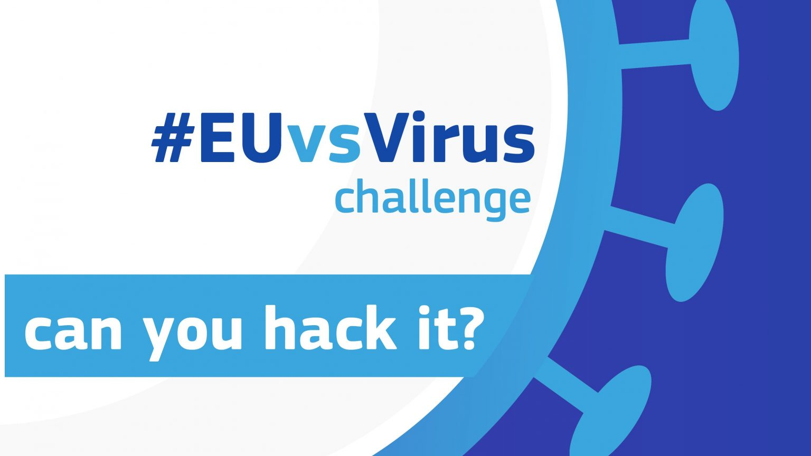

# We Care Sweden
### EUvsVirus Hackathon

`Devpost Submission Link` : https://devpost.com/software/wecare-5l9dgi

### Hotspot Development for Live Maps
Environmental Hotspots Development as a measure of environmental risk live map based on user-input area codes for location is then connected to Covid19 infected datasets and modelled using PyKrige Kriging modelling method. We had also a better clarity towards approaching and defining risk over predictive modelling versus developing hotspots over live datasets as well the importance of taking plenty of care developing models that may have substantial influence public perception towards engaging in risk factors during Covid19 pandemic.
  - **This section contains 3 folders consisting of:**
    
    - **Environmental** 
        Geocoding of API sourcing live datasets and preliminary development to Kriging 2D interpolation model using live datasets to form live mapping visualisation are included in this folder  
     - **Symptoms**
        From user input data from our We Care app and desktop interface, this section will, in future, focus on better developing and fine tune hotspot details for live map 
     - **Contacts**
        From user input data from our We Care app and desktop interface, this section will, in future, focus on better developing and fine tune hotspot details for live map 
    
### Tech

WeCare team thanks a number of experts and open source projects as part of building this solution

* [PyKrige](http:/https://github.com/GeoStat-Framework/PyKrige/blob/master/README.rst/ "PyKrige") - 2D and 3D Ordinary and Universal Kriging
* [Open Refine](http:/https://openrefine.org/ "Open Refine") - Powerful tool for working with messy data
* [Geo Stats Models](http:/https://github.com/cjohnson318/geostatsmodels/ "Geo Stats Models") - Implementation of ideas from Clayton V. Deutsch and Michael Pyrcz's book Geostatistical Reservoir Modeling
* [Geostatpy](http:/https://github.com/exepulveda/geostatpy/ "Geostatpy") -  Geostatistical python toolbox.
* [Institute of Earth Sciences Coders](http:/https://iescoders.com/plotting-the-geospatial-data-clipped-by-coastlines-in-python/ "Institute of Earth Sciences Coders") -  Plotting the geospatial data clipped by coastlines in Python by Utpal Rai
* [Svenska Städer](http:/https://github.com/sphrak/svenska-stader/ "Svenska Städer") -  Swedish cities in csv format with coordinates 
* [Svenska Städer](http:/https://github.com/sphrak/svenska-stader/ "Svenska Städer") -  Swedish cities in csv format with coordinates 
* [Open Geocoding API](http:/https://developer.mapquest.com/documentation/open/geocoding-api/address/get/ "Open Geocoding API") - Geocoding service enables you to take an address and get the associated latitude and longitude.
* [Google Maps Platform](http:/https://developers.google.com/maps/documentation/geocoding/intro/ "Open Geocoding API") -  Geocoding API web service
* [Folkhälsomyndigheten](https://experience.arcgis.com/experience/09f821667ce64bf7be6f9f87457ed9aa) - Sweden COVID19 dataset
* [Statistikdatabasen](http://www.statistikdatabasen.scb.se/pxweb/en/ssd/) - Sweden population and location statistics
* [Simple Maps](http:/https://simplemaps.com/data/se-citiesd/) - Sweden population and location statistics
* [Diva GIS](http:/https://www.diva-gis.org/gdata/) - Global GIS Shapefiles 
* [Covid19 Scenarios](http:/https://covid19-scenarios.org/) - Web application as a planning tool for COVID-19 outbreaks in communities across the world using SIR (Susceptible-Infected-Recovered) model
* [Golden Software Surfer](https://www.goldensoftware.com/contact-us) - Advanced geospatial modelling tool with license (Many thank you to Golden Software team for offering free, temporary license due to Covid19 WFH)

### Developing Hotspots
We were fortunate to have spoken directly towards Skill Mentor **Alise. E (MD, ID, IM specialist / Epidemiology / WGS / IT in healthcare)** that gave us a more thorough and better insights towards developing live mapping of datasets and the use of realtime vs prediction models.

To best summarise the conversation with Alise here with dotpoints :
- Risk can be approached in two ways, **risk estimation after the exposure** or **overall risk for every individual**
- **Odd's Ratio use must take into account a lot of factors** If we choose to do the Odd's Ratio as part of our model, we have to predict and calculate the % of asymptomatic people in society etc.
- KI and Swiss Institute collaboration with Alise have developed a **scenario-testing mathematical model**  [(Covid19 Scenarios)](http:/https://covid19-scenarios.org//) that focuses on Population, Epidemiology and Mitigation information, which gives a  prediction model. This model was based on model assumptions and parameter choices and therefore are not medical predictors.
- They are working on a **state-wise risk prediction model** and it is important to be careful in adapting risk definitions into live mapping tools. **Hotspots using live dataset modelling** has been encouraged as opposed to trying to characterise and predict risk models. Our duty to reporting accurate and reliable information to the public is the main focus on the development of this prototype. 
- Within the EUvsVirus Hackathon, we chose to actively shift from prediction models towards **incorporating daily monitoring from user inputs** 
- The live hotspot model that is in the "Environment" folder will focus on  incorporating datasets to questions such as:
    - **How may people are sick in Sweden?**
    - **Are numbers of infected and fatalities are going up or going down?**
    - **How many are in the ICU?**
    - **What are the concentration of hotspots that can be described from data?**
- Therefore, continuing development towards the use of live datasets with Kriging 2D interpolation model for better live mapping visualisation is used in this section of our project.

### Data interrogation with free temporary licensed Surfer software

We originally interrogated the current dataset with Golden Software Surfer to understand the capabilities of developing live mapping through Covid19 Sweden dataset. The preliminary snapshot of number of fatalities, infected and in intensive care data were taken on the week of 14th to 25th April 2020. Kriging model from this software was used to form a first interpretation of the geospatial map we would like to implement in the app. 

